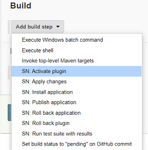
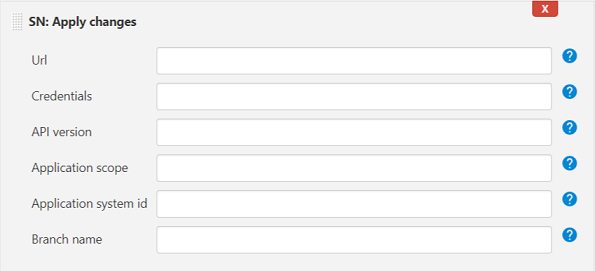
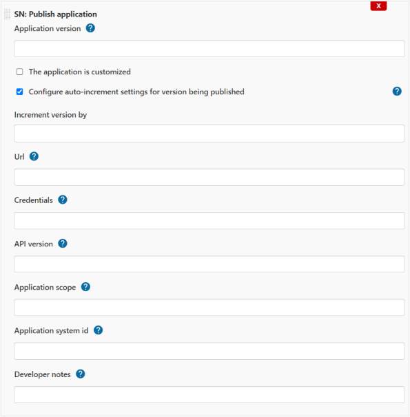
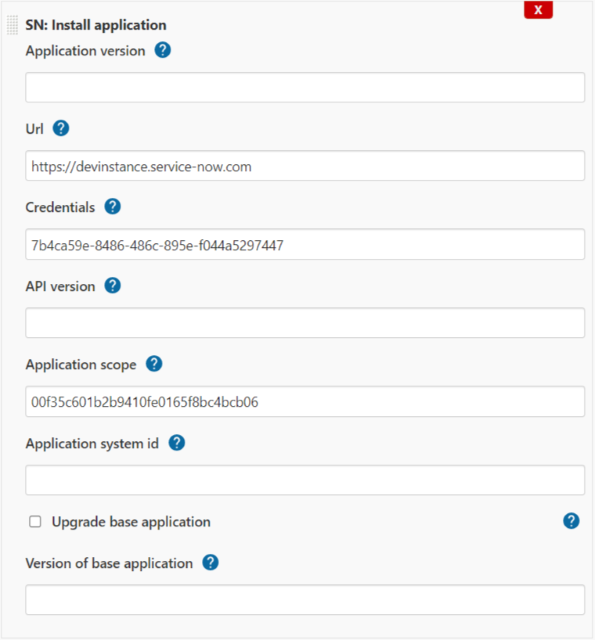
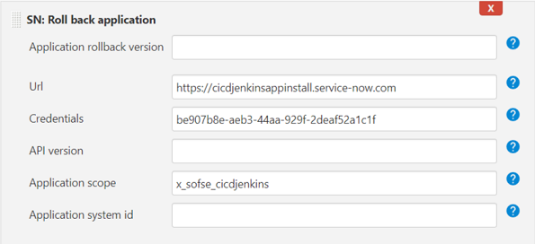
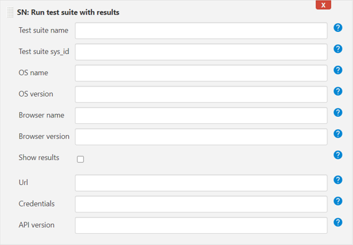
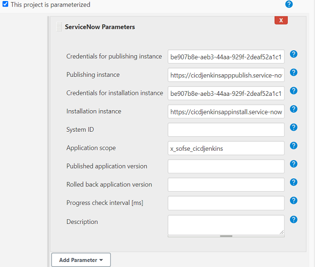

ServiceNow CI/CD Plugin for Jenkins
===================

#### About the plugin
This plugin provides build steps with easy parameter setup to help you get started faster with setting up a CI and CD pipeline for developing apps on the Now Platform.

This plugin integrates with Jenkins the [Now Platform from ServiceNow](https://www.servicenow.com/now-platform.html). For bug reports, see [bugs](https://issues.jenkins-ci.org/issues/?filter=22440) or [all open issues](https://issues.jenkins-ci.org/issues/?filter=22441). For documentation, see [official plugin site](https://plugins.jenkins.io/servicenow-cicd).

---
- [CI/CD integration with platform NOW](#ci-cd-integration-with-platform-now)
  * [Build steps](#build-steps)
    + [SN: Apply changes](#sn--apply-changes)
    + [SN: Publish application](#sn--publish-application)
    + [SN: Install application](#sn--install-application)
    + [SN: Roll back application](#sn--roll-back-application)
    + [SN: Run test suite with results](#sn--run-test-suite-with-results)
    + [SN: Activate plugin](#sn--activate-plugin)
    + [SN: Roll back plugin](#sn--roll-back-plugin)
- [Build templates](#build-templates)
- [Scripting](#scripting)
  * [Build steps](#build-steps-1)
  * [ServiceNow parameters](#servicenow-parameters)
- [Troubleshouting](#troubleshouting)

<small><i><a href='http://ecotrust-canada.github.io/markdown-toc/'>Table of contents generated with markdown-toc</a></i></small>

## CI/CD integration with platform NOW
The plugin delivers additional build steps that can be used in order to integrate CI / CD actions made on NOW platform using Jenkins as main Ci / CD tool.
There are currently 7 build steps that can execute remotely action on the platform NOW. All of them starts from the phrase "SN" (like ServiceNow).

### Build steps
#### SN: Apply changes
Starts applying changes from a remote source control to a specified local application.
The source control must be configured on the platform.
There is available a bunch of configuration together with the build step:

&nbsp; | Description
------| ------------
__Url__ | ServiceNow instance url, where an application will be published
__Credentials__ | User name and password defined in global credentials and configured in Jenkins (credentials ID is required here)
__API version__ | Optional. Version of the endpoint to access. For example, v1 or v2. Only specify this value to use an endpoint version other than the latest.
... | TODO ...

#### SN: Publish application
Publishes the specified application and all of its artifacts to the application repository.

#### SN: Install application
Installs the specified application from the application repository onto the local instance, the instance defined in the field *Url*. The application must have been previously published, using the build step [SN: Publish application](#sn--publish-application).

#### SN: Roll back application
Initiates a rollback of a specified application to a specified version, according to the configuration done in the build step.
If the field `Application rollback version` is empty and one of the previous steps was [SN: Install application](#sn-install-application),
then the downgrade version will be the one before the installation of the application.

#### SN: Run test suite with results
Starts a specified automated test suite. The test suite runs on the instance pointed in *Url* or configured via *ServiceNow Parameters* in *Installation instance*.

#### SN: Activate plugin
Activates the specified plugin.

#### SN: Roll back plugin
Rolls back the specified plugin to the previous installed version. If no prior version has been installed, the build step will fail.

### Global build parameters
Together with the plugin comes additional parameter `ServiceNow Parameters` under the checkbox `This project is parameterized` in General section of the build configuration.

This new parameter or set of configuration variables allows user to configure most of the steps (integrated with the platform NOW) in convenient way from one place.
You can find below description of each field, that were implemented here:

&nbsp; | Description
------ | -----------
__Credentials for publishing instance__ | Credentials ID configured in Jenkins and used to get access to the instance were an application will be or is already published.
__Publishing instance__ | ..

## Build templates
It is important to have possibility to start with the rapid implementation of CI / CD actions in your project. That's why we prepared some build templates for common cases.
TODO: ...

## Scripting
### Build steps
There is also possible to write pipeline scripts using integrated build steps.
You can find keywords and main usage of all steps described above, together with the configuration.

* `snApplyChanges`
* `snPublishApp`
* `snInstallApp`
* `snRollbackApp`
* `snRunTestSuite`
* `snActivatePlugin`
* `snRollbackPlugin`

### ServiceNow parameters
TODO: first test that if applicable

## Samples
TODO: remove this section if nothing to write

## Troubleshouting
TODO: remove this section if nothing to write
